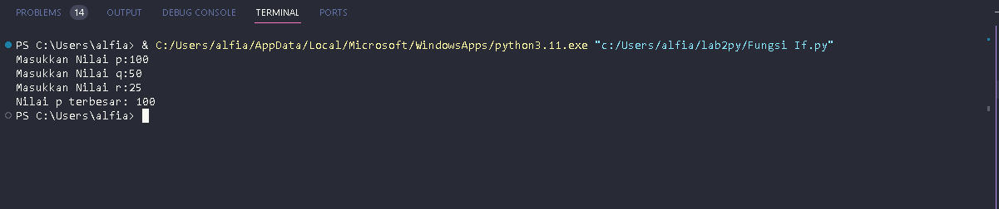
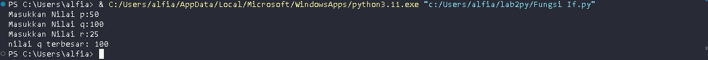
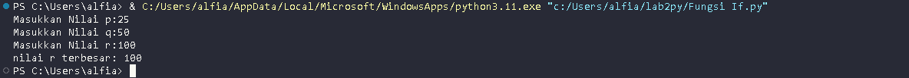
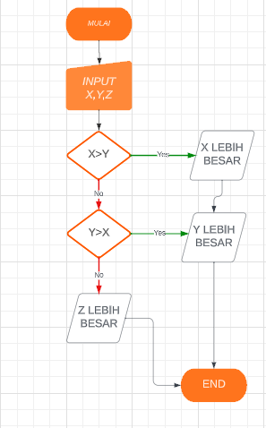
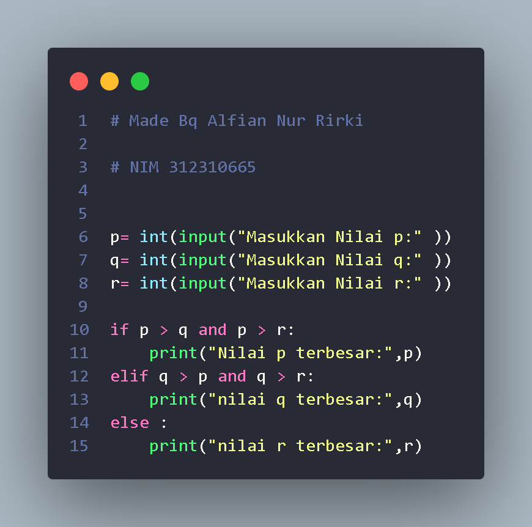
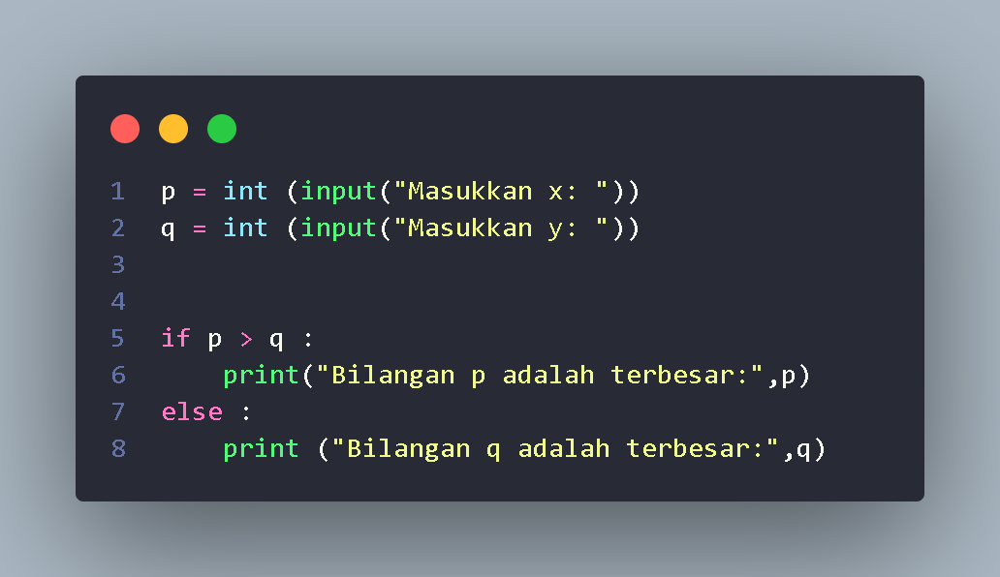

# labspy02

<h1>Fungsi If Angka Terbesar Dari 3 Angka</h1>

+ 
Buat integer masukan nilai p,q,r

+ 
Buat Logika If p lebih besar dari q dan p lebih besar dari r

+ 
Maka Nilai p terbesar

 

+ 
Lanjutkan logika Dengan elif q lebih besar dari p dan q lebih besar dari r

+ 
Maka Nilai q terbesar

 

+ 
Dilanjut dengan else maka Nilai r terbesar

 

+ 
Tampilan Flowchart

 

+ 
Tampilan Program

 

 <h1>Lab 2 Latihan 1</h1>
 
+ 
 Buat program sederhana dengan input 2 buah bilangan 

 + 
 Tentukan Bilangan terbesar dari keduanya

 + 
 Dengan Menggunakan statement if 

 + 
Buat integer input untuk dua bilangan

 + 
Gunakan logika if dan else 

 + 
Tampilan Program

+ 
Tampilan Output

![gambar](dokumentasi/

