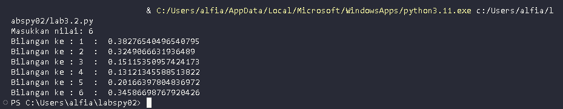

# Peftemuan 7

<h1>Fungsi If Angka Terbesar Dari 3 Angka</h1>

+ 
Buat integer masukan nilai p,q,r

+ 
Buat Logika If p lebih besar dari q dan p lebih besar dari r

+ 
Maka Nilai p terbesar

 

+ 
Lanjutkan logika Dengan elif q lebih besar dari p dan q lebih besar dari r

+ 
Maka Nilai q terbesar

 

+ 
Dilanjut dengan else maka Nilai r terbesar

 

+ 
Tampilan Flowchart

 

+ 
Tampilan Program

 

 <h1>Lab 2 Latihan 1</h1>
 
+ 
 Buat program sederhana dengan input 2 buah bilangan 

 + 
 Tentukan Bilangan terbesar dari keduanya

 + 
 Dengan Menggunakan statement if 

 + 
Buat integer input untuk dua bilangan

 + 
Gunakan logika if dan else 

 + 
Tampilan Program

+ 
Tampilan Output

<h1>Lab 2 Latihan 2</h1>

+ 
Buat program untuk mengurutkan data berdasarkan input sejumlah data

+ 
Kemudian tampilkan hasilnya secara berurutan

+ 
Buat integer input 3 variable

+ 
Gunakan list.sort untuk mengurutkan data yang di input

+ 
Tampilan Program

+ 
Tampilan Output

 

<h1>Lab 3 Latihan 1</h1>

+ 
Buat program perulangan dan bertingkat (nested) 

+ 
Buat Variable Baris dan Kolom untuk data

+ 
Gunakan for untuk bar dan col lalu range 

+ 
Lalu gunakan Tab untuk membuat bar+col lalu print

+ 
Tampilan program

+ 
Tampilan Output

<h1>Lab 3 Latihan 2</h1>

+ 
Buat program bilangan acak yang lebih kecil dari 0,5

+ 
Nilai n diisi pada runtime

+ 
Gunakan kombinasi while dan for

+ 
Tampilan program

+ 
Tampilan Output

